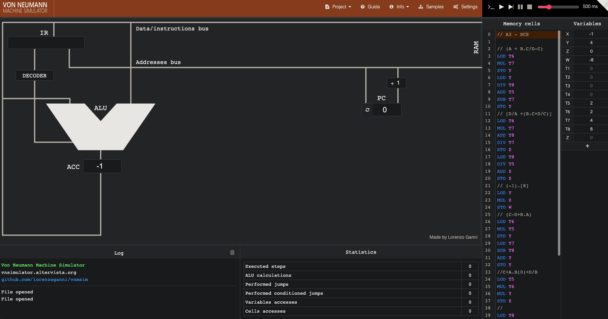

  

<h1 align="center">Assembly-UAM</h1>

<h3 align="center">
 Exercício que fiz na linguagem assembly na matéria de Sistemas Computacionais e Segurança. 
</h3>

 <a href="#objetivo">Objetivo</a> •
 <a href="#solucao">Solução</a> • 
 <a href="#autor">Autor</a> •

## ✅ Objetivo

O objetivo desse trabalho é programar na linguagem assembly para desenvolver a resolução de conta abaixo.

  

## 🕵🏼‍♂️ Solução

Para realizar essa tarefa foi utilizado o Simulador de Von Neumann
  
  
 ### Von Neumann
 
Para uma breve contextualização, a arquitetura foi criada por **John Neumann** que possibilitava o **armazenamento de programas** em um **computador**.

Esta arquitetura tem como característica armazenar os programas no mesmo espaço da memória de dados que permite a manipulação dos programas.

Que por sua vez possui:

- Unidade de Processamento (**Processador** atualmente)
- Unidade de Controle
- Unidade de Armazenamento (Ram, Cache etc atualmente)

### Métodos

Para realizar a conta no simulador foi utilizado os métodos 
