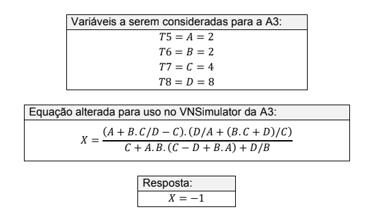

<h1 align="center">
  Assembly-UAM
</h1> 

<h3 align="center">
 Exercício que fiz na linguagem assembly na matéria de Sistemas Computacionais e Segurança. 
</h3>

## Objetivo

O objetivo desse trabalho é programar na linguagem assembly para desenvolver a resolução de conta abaixo 

  

## Solução 

Para realizar essa tarefa foi utilizado o Simulador de Von Neumann

